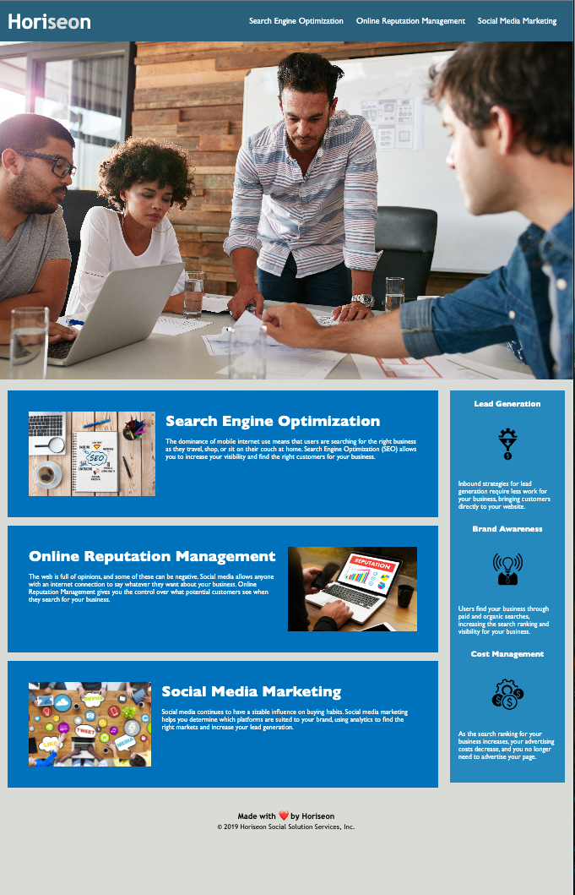

# marketing-agency-accessibility-website
This project is to provides accessibility to the website.

## Description

This project is a marketing agency website, designed to showcase the agency's services, including search engine optimization, online reputation management, and social media marketing. The website emphasizes accessibility and search engine optimization best practices.

- The motivation behind this project is to create a professional and informative website for a marketing agency, optimizing it for accessibility and search engines to reach a wider audience.

- This project addresses the need for a web presence for a marketing agency by providing information about the agency's services and benefits. It also demonstrates the importance of web accessibility and SEO best practices.

- Through this project, we gained knowledge in creating a well-structured website with semantic HTML and CSS. We also learned about the importance of web accessibility and SEO in modern web development.

## Installation

N/A

## Usage

To view and interact with the marketing agency website:

- Open the `index.html` file in your web browser.

- 

## Credits

N/A

## License

Please refer to the LICENSE in the repo.
